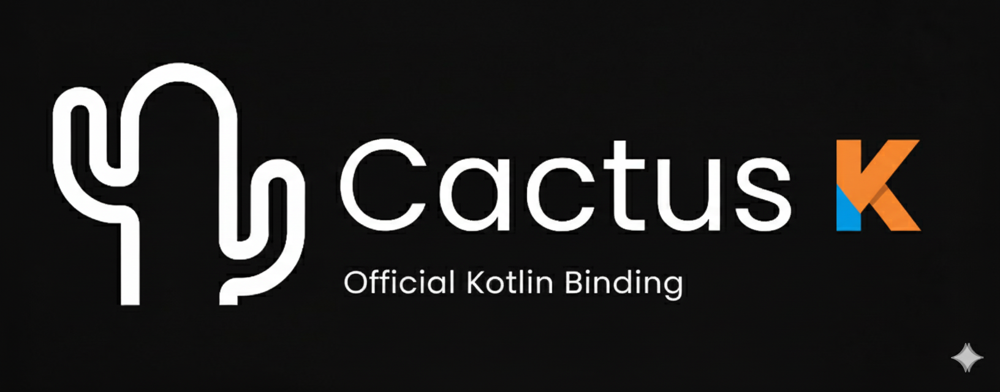

Official Kotlin Multiplatform plugin for Cactus, a framework for deploying LLM/VLM/TTS models locally in your app. Requires iOS 12.0+, Android API 24+.

## Resources
[](https://github.com/cactus-compute/cactus) [](https://huggingface.co/Cactus-Compute/models?sort=downloads) [](https://discord.gg/bNurx3AXTJ) [](https://cactuscompute.com/docs)


## Installation
Add to your KMP project's `build.gradle.kts`:
```kotlin
kotlin {
    sourceSets {
        commonMain {
            dependencies {
                implementation("com.cactus:library:0.2.4")
            }
        }
    }
}
```

## Platform setup
- **Android:** Works automatically - native libraries included.
- **iOS:** In Xcode: File → Add Package Dependencies → Paste `https://github.com/cactus-compute/cactus` → Click Add

## Text Completion
```kotlin
import com.cactus.CactusLM
import kotlinx.coroutines.runBlocking

runBlocking {
    val lm = CactusLM(
        threads = 4,
        contextSize = 2048,
        gpuLayers = 0 // Set to 99 for full GPU offload
    )

    val downloadSuccess = lm.download(
        url = "path/to/hugginface/gguf",
        filename = "model_filename.gguf"
    )
    val initSuccess = lm.init("qwen3-600m.gguf")

    val result = lm.completion(
        prompt = "Hello!",
        maxTokens = 100,
        temperature = 0.7f
    )
}
```

## Speech To Text
```kotlin
import com.cactus.CactusSTT
import kotlinx.coroutines.runBlocking

runBlocking {
    val stt = CactusSTT(
        language = "en-US",
        sampleRate = 16000,
        maxDuration = 30
    )

    // Only supports default Vosk STT model for Android & Apple FOundation Model
    val downloadSuccess = stt.download()
    val initSuccess = stt.init()

    val result = stt.transcribe()
    result?.let { sttResult ->
        println("Transcribed: ${sttResult.text}")
        println("Confidence: ${sttResult.confidence}")
    }

    // Or transcribe from audio file
    val fileResult = stt.transcribeFile("/path/to/audio.wav")
}
```

## Visual Language Model
```kotlin
import com.cactus.CactusVLM
import kotlinx.coroutines.runBlocking

runBlocking {
    val vlm = CactusVLM(
        threads = 4,
        contextSize = 2048,
        gpuLayers = 0 // Set to 99 for full GPU offload
    )

    val downloadSuccess = vlm.download(
        modelUrl = "path/to/hugginface/gguf",
        mmprojUrl = "path/to/hugginface/mmproj/gguf",
        modelFilename = "model_filename.gguf",
        mmprojFilename = "mmproj_filename.gguf"
    )
    val initSuccess = vlm.init("smolvlm2-500m.gguf", "mmproj-smolvlm2-500m.gguf")

    val result = vlm.completion(
        prompt = "Describe this image",
        imagePath = "/path/to/image.jpg",
        maxTokens = 200,
        temperature = 0.3f
    )
}
```

## Building the library
- Build the Library with `scripts/build.sh`.
- Navigate to the example app with `cd kotlin/example`.
- Open your simulator via Xcode or Android Studio, [walkthrough](https://medium.com/@daspinola/setting-up-android-and-ios-emulators-22d82494deda) if you have not done this before.
- Always start app with `./gradlew :composeApp:run` for desktop or use Android Studio/Xcode for mobile.
- Play with the app, and make changes either to the example app or library as desired.
